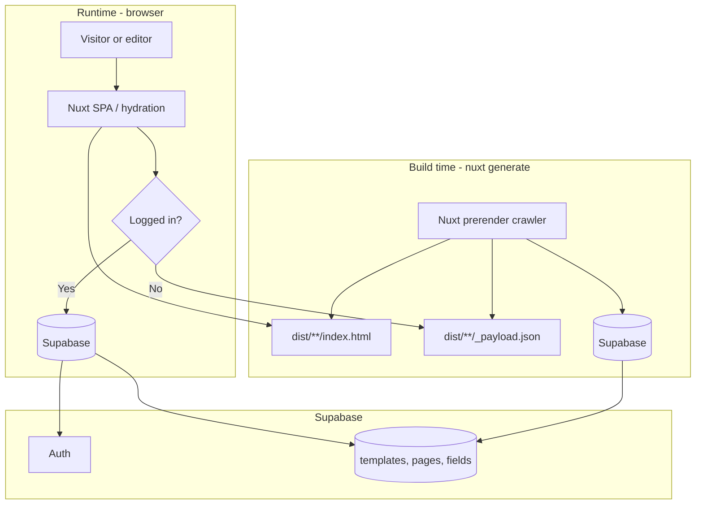

# Architecture

## Summary

**ghots-cms** is a monorepo with:

1. **`packages/nuxt-cms`** — reusable Nuxt layer (editor UI, composables, migrations).
2. **`demo/`** — reference site (templates, slices, globals, E2E).

The demo app:

1. Loads page definitions and field values from **Supabase** (Postgres + Auth).
2. **Prerenders** public pages at build time into static HTML in `demo/dist/`.
3. Lets **authenticated** users bypass the static page payload, seed empty fields, and edit content via a **modal** (click delegation on `[data-name]` elements or the **CMS sidebar** field list).

There is no custom backend server in this repo — the app talks to Supabase directly from the browser (and during prerender via the same client).

## High-level diagram

## Data loading matrix

| Key | Composable | Guest (static `dist/`) | Guest (`npm run dev`) | Logged in |
| --- | ---------- | ---------------------- | --------------------- | --------- |
| `page:${slug}` | `usePageContent` | Payload / prerender cache via `getCachedData` | Supabase | Supabase |
| `page-list` | `usePageListData` | Payload / prerender cache via `getCachedData` | Supabase | Supabase |
| `global:${key}` | `useGlobalData` | Payload / prerender cache via `getCachedData` | Supabase | Supabase |

Page content, nav, and globals are designed to be static for guests on a successful `nuxt generate` deploy. See [Static generation](./static-generation.md).

## Core flows

### Public visitor (logged out, static hosting)

1. Request `/` → host serves `dist/index.html` (field text is already in the HTML from prerender).
2. JS hydrates; `useAsyncData('page:/', …)` uses **`getCachedData`** → reads `/_payload.json` → **does not** re-run `usePageContent` against Supabase when cache hits.
3. `usePageListData()` and `useGlobalData('site')` use the same payload cache — **no** runtime Supabase calls on a successful static deploy.
4. Template renders via `DefaultPage` with values from the cached payload.

### Editor (logged in)

1. `getCachedData` returns `undefined` for page content → **`usePageContent`** runs against Supabase.
2. If the page has no `fields` rows yet, **`seedFieldsFromSchema`** inserts them from the template’s `field_schema`.
3. **`CmsSidebar`** in `demo/app/app.vue` — toggleable left panel with **Content**, **Pages**, and **Meta** tabs. Current page data is synced from `[...slug].vue` via **`useCmsPage()`** / **`useCmsPanel`** (slug-matched `watchEffect`; see [CMS sidebar](./cms-sidebar.md)).
4. **`PageEditorProvider`** enables click-to-edit on the page; sidebar field rows use the same **`usePageEditor`** modal. Saves go to the `fields` table via `updateFieldValue`.
5. `watch(loggedIn, () => refresh())` refetches when the session changes.

### Build (`npm run generate`)

1. Nitro prerenders `/` and **crawls** internal links (`<NuxtLink>` in nav).
2. For each URL, Nuxt runs `demo/app/pages/[...slug].vue` server-side, which calls `usePageContent` (Supabase must be reachable at build time).
3. Output: static HTML + per-route `_payload.json` under `demo/dist/`.
4. Payload must be JSON-serializable — editor callbacks are **not** stored in `useState` (see [Modal editing](./inline-editing.md)).

## Technology choices

| Layer | Choice | Rationale |
| ----- | ------ | --------- |
| Framework | Nuxt 4 | File-based routing, `useAsyncData`, static generation |
| CMS package | Nuxt layer (`packages/nuxt-cms`) | Portable editor + composables; consumer owns templates/slices |
| Hosting shape | Static `dist/` | Simple deploy; `npm run static` for local preview |
| Data + auth | Supabase | Postgres, RLS, email/password auth without a custom API |
| Templates | Vue SFCs in `demo/app/templates/` | Full control over markup; mapped by `templates.key` |
| Editor UX | Sidebar + click delegation + modal | No per-field wrapper components; editing gated by `loggedIn` |

## Security notes

- **Anon key** is public in the client; protection is **Row Level Security** (read for all, writes for `authenticated` only).
- Prerendered HTML and `_payload.json` are **public**. Do not store secrets in field values meant to be private.
- Skipping Supabase for guests is a **performance / static-site** behavior, not authorization. RLS still defines who can write.

## Extension points

- New page layouts: add a Vue file under `demo/app/templates/` (or your consumer `app/templates/`) and register it in `useTemplate.ts`.
- New field types: extend `FieldType`, schema JSON, field registry, and template markup in `packages/nuxt-cms/app/fields/registry.ts`.
- New routes: insert rows in `pages` (and ensure nav/crawler can reach them).
