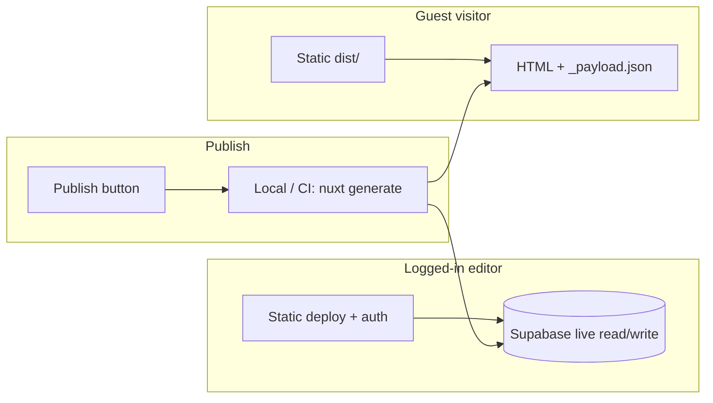

# Project vision

Reference document for what **ghots-cms** is building toward. Use this to decide scope, prioritize work, and validate features.

> **Name:** Working title only — [Ghost](https://ghost.org/) is an existing CMS. Rename before publishing a package.

---

## One-line summary

**ghots-cms** is a static-first, Supabase-backed page builder for Nuxt sites: developers define templates, slices, and global regions in Vue; editors change content on the deployed static site; a **Publish** action rebuilds what guests see.

---

## What we are building

### For developers

- A **reference Nuxt app** (later an **npm package**) that includes everything needed to start: Supabase schema, auth, editor UI, static generation, and docs.
- **Templates** — Vue SFCs that define page layout and wire up CMS fields/slices.
- **Slices** (Prismic / Storyblok style) — reusable section types defined in code. Not limited per template; a page can mix any slices the developer registers.
- **Page-level fields** — content that belongs to the page itself, not inside a slice (e.g. SEO title, hero headline above the slice list).
- **Global regions** — developer-declared shared content (nav, footer, site settings) available on every page. Defined in templates/code, not invented by editors.
- **No custom backend** — browser and build pipeline talk to Supabase (Postgres, Auth, Storage) directly.

### For editors

- Edit on the **same static deploy** visitors use — no separate CMS admin URL required.
- **Logged in** → live data from Supabase (changes visible immediately).
- **Logged out (guest)** → prerendered HTML + cached payload only; **zero Supabase calls** when fully implemented.
- **One editing surface** — a **modal** for all field types. The sidebar navigates the content tree and opens the modal; it does not host separate inline editors.
- **Sidebar** — collapsible panel with a flexible nested tree (page → fields, page → slices → fields, nested sections, etc.), page list, simple page creation, and page meta.
- **Publish** — explicit button when ready to update the public static site (triggers local/CI `nuxt generate` for now).

### For visitors

- Fully static HTML from `dist/` — fast, cheap hosting (Cloudflare Pages, Netlify, S3 + CloudFront, etc.).
- Content reflects the last **published** build, not in-progress editor drafts.

---

## Core concepts

```text
Developer-defined (code + DB schema)          Editor-managed (Supabase)
────────────────────────────────────          ─────────────────────────
Template (Vue SFC + key)                      Page (slug, meta, template)
Slice types (Vue + field schema)              Slice instances on a page (ordered)
Global region definitions                     Global field values
Page-level field definitions                  Page-level field values
Field types (plain_text, link, richtext, …)   Field values + repeatables
```

### Templates

A template is a Vue component plus metadata (`templates.key`, optional default page-level schema). It decides:

- Which **page-level fields** exist.
- Where **slice instances** render (typically an ordered list).
- Which **global regions** the layout consumes.

### Slices (page builder)

- Each **slice type** is a Vue component + JSON **field schema** (like today’s `field_schema`, but per slice type).
- Editors **add, remove, and reorder** slice instances on a page.
- The same slice type can appear **multiple times** on one page.
- Slice types are **project-wide**, not locked to one template (keep rules minimal).

### Page-level fields

Fields attached to the page root — not inside a slice. Example: meta title, on-page H1, intro paragraph above the slice stack.

### Global content

Content shared across all pages (nav links, footer copy, logo URL).

- **Concept:** fields not tied to a normal page URL (option C).
- **Likely implementation:** dedicated global records or pseudo-pages (e.g. `_global/nav`) that templates reference by key — exact schema TBD.
- **Editor behavior:** updates are **immediate** for logged-in users (same as page fields).
- **Guest behavior:** updates appear after **Publish** (static rebuild).

### Field types

| Type | v1 | Editor UX | Notes |
| ---- | -- | --------- | ----- |
| `plain_text` | ✅ exists | Modal | Click on page or sidebar |
| `link` | 🎯 v1 | Modal | URL, label, optional target |
| `richtext` | 🎯 v1 | Modal | Store structured source + rendered HTML on save; implementation TBD |
| `section` | ✅ exists | — | Structural container |
| `image` | post-v1 | Modal | Supabase Storage; defer until link + richtext ship |
| `array` / repeatable | post-v1 | Sidebar add/remove → modal per item | Avoid cluttering the live page UI |

All editable types use the **same modal**. Sidebar lists structure and opens the modal.

### Page meta (v1 — keep simple, follow common SEO practice)

Minimum set to capture early:

| Field | Purpose |
| ----- | ------- |
| `slug` | URL path (unique, normalized) |
| `title` | Internal / nav label |
| `meta_title` | `<title>` / OG title (fallback to `title`) |
| `meta_description` | `<meta name="description">` |
| `og_image` | Social preview (URL; Storage later) |
| `noindex` | Optional; hide from search |

Extend later: canonical URL, structured data, publish date, etc.

---

## Architecture principles

### Static-first, Supabase as source of truth



- **Today:** guests skip Supabase for page content, nav, and globals via `getCachedData` on a successful static deploy.
- **Target:** guests never call Supabase; all public data comes from prerender.

### Draft vs published

| Audience | Page / global content | When guest sees edits |
| -------- | --------------------- | --------------------- |
| Logged-in editor | Live Supabase | N/A |
| Guest | Last `nuxt generate` output | After **Publish** rebuild |

This matches the existing `loggedIn` → bypass cache behavior in `useCmsPage()`.

### Hosting & cost

- Serve `dist/` from any static host — no Node server required in production.
- Supabase free/low tier for DB, auth, and storage.
- Avoid extra services until needed (S3 + CloudFront optional later).

### Portability (later)

1. **Now:** reference implementation in this repo — prove the model on a real site shape.
2. **Later:** extract to an npm package (`@…/nuxt-cms` or similar) containing modules, migrations, components, composables, and setup docs.
3. **Per project:** developer adds templates, slice components, global regions, and Supabase project.

Isolation goal: a new Nuxt app should be able to install/configure the package without copying ad hoc CMS code.

---

## Editor UX (target)

### Sidebar

- Toggle panel (already started in `CmsSidebar.vue`).
- Tabs or sections: **Content tree**, **Pages**, **Page meta** (exact layout TBD).
- **Content tree:** nested, schema-driven — not fixed to `page → section → field`.
- Click field → **open modal** (and optionally scroll/highlight `[data-name]` on page).
- **Pages tab:** list, navigate, **create page** (simple: slug, title, pick template).
- Slice management: add slice (pick type), reorder, remove — primarily from sidebar.

### Modal

- Single editor for every field type.
- Plain text today; link and richtext in v1.
- Save → Supabase → patch local state (store/composable pattern — see `todo.md`).

### On-page interaction

- Click delegation on `[data-name]` opens the modal for supported types.
- No inline contenteditable for v1 — consistency over WYSIWYG on canvas.

---

## Explicit non-goals (for now)

- Multi-tenancy (one Supabase project per site).
- Roles / permissions beyond “authenticated can edit”.
- Visual drag-and-drop page builder (sidebar reorder is enough initially).
- Editors defining new slice types or field schemas.
- Hosted rebuild service (local/CI `nuxt generate` only).
- CI for E2E (local Playwright on developer machine).
- Competing with Ghost, WordPress, or full headless CMS feature parity.

---

## Validation: how we know a feature is done

Each capability should have a **manual check** and, where practical, a **Playwright test**.

### Infrastructure

| Objective | Validate by |
| --------- | ----------- |
| Playwright setup | `npm run test:e2e` runs locally against dev server + real Supabase |
| DB reset between runs | Teardown script deletes test pages/fields or restores seed state |
| Test auth user | Documented env vars for editor login in E2E |

### Guest experience (static)

| Objective | Validate by |
| --------- | ----------- |
| Zero Supabase for guests | Network tab: no requests to Supabase host when logged out on `npm run static` |
| Guest sees published content only | Edit field as admin → guest unchanged until Publish + regenerate |
| Nav from static payload | Page list baked into prerender or payload — no runtime fetch |

### Editor experience

| Objective | Validate by |
| --------- | ----------- |
| Login → live data | Edit saves; refresh shows new value without regenerate |
| Modal-only editing | All field types open same modal from sidebar and page click |
| Sidebar tree | Nested fields/slices visible; click opens modal |
| Patch local state | Save updates page without full refetch (store or `patchField` pattern) |

### v1 feature set

| Objective | Validate by |
| --------- | ----------- |
| Slices on page | Add/remove/reorder slice instances; each renders with correct fields |
| Page-level fields | Fields outside slices editable and render correctly |
| Global regions | Change global field → all pages show new value when logged in |
| Link field | Modal edit URL + label; renders in template |
| Rich text field | Modal edit; stored source + HTML; renders in template |
| Page creation UI | Create page from sidebar → navigable URL with seeded fields |
| Page meta | Meta fields editable; reflected in `<head>` on generate |
| Publish flow | Publish triggers generate (or documents manual step); E2E: guest sees content after publish |

### Portability (post-v1)

| Objective | Validate by |
| --------- | ----------- |
| Second project smoke test | Fresh Nuxt app consumes package; one template + one page works |
| Docs | “Getting started” covers Supabase, env, templates, deploy |

---

## Relationship to current codebase

What exists today (see [Architecture](./architecture.md)):

- Single template (`default`), flat schema (`title`, `main` section, `body`).
- Page = template instance; **no slice instances**, **no globals**, **no page meta table**.
- Modal + sidebar for registered field types (plain_text, link, richtext, image).
- Static generate works; guest payload cache covers page content, nav, and globals on deploy.

The data model will need to evolve for slices, globals, meta, and new field types. Expect new tables or JSON columns rather than stretching `fields` alone.

---

## Open decisions (resolve while building)

1. **Slice storage** — `page_slices` table + fields keyed by slice instance id vs JSON document per page.
2. **Global storage** — `globals` table vs keyed pseudo-pages.
3. **Rich text editor** — TipTap, Lexical, Markdown, or simple textarea for v1.
4. **Publish button** — UI-only (runs local script / opens CI) vs webhook stub for future automation.
5. **Package name** — rename before npm publish.

---

## Suggested phasing

Detailed todos live in [`todo.md`](../todo.md). High-level order:

1. **E2E foundation** — Playwright, auth helper, DB reset, tests for login + plain_text edit + guest vs admin data paths.
2. **Editor state** — store/composable so saves patch UI reliably (already partially `patchField`).
3. **Zero Supabase for guests** — cache nav + globals in prerender.
4. **Data model v2** — slices, page-level fields, meta, globals schema.
5. **Sidebar v2** — flexible tree, page create, meta panel; sidebar → modal only.
6. **Field types** — link, richtext.
7. **Publish UX** — button + documented generate flow; E2E publish path.
8. **Images** — Supabase Storage field type.
9. **Arrays** — repeatable groups via sidebar.
10. **Package extraction** — after reference app matches this doc.
