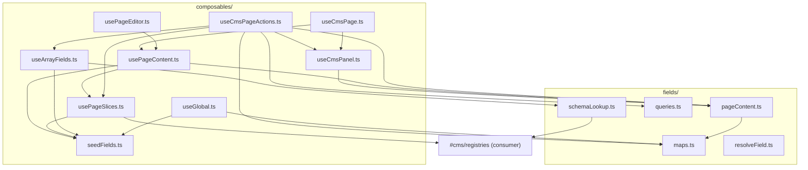

# Hard code review — whole codebase audit

Living checklist from a **thermo-nuclear code quality review of the entire repo** (not a single PR). Use alongside [`todo.md`](./todo.md) (product roadmap), [`todo2.md`](./todo2.md) (package-extraction audit), and [`todo3.md`](./todo3.md) (commit `7dcf828` follow-up).

**Review bar:** do not approve merely because behavior works. Prefer code-judo moves that delete complexity rather than polish it. No file should cross 1000 lines without strong justification. No ad-hoc branching bolted onto shared paths.

**Scope:** `packages/nuxt-cms/` (core layer), `demo/` (reference app), `examples/minimal/` (smoke consumer), `docs/`, E2E infra.

**Date:** 2026-05-31

---

## Verdict

**Not approved under this bar.**

The package extraction and recent field-layer refactors are real progress — no 1000-line files, architecture docs match code, PageContent rebuild is unified, array insert no longer refetches the whole page. But the mutation layer still has one foot in the old "seed then refetch" world (slices), the editor/guest state model is more complex than it needs to be, unit tests give misleading confidence on the most important paths, and module boundaries aren't fully settled.

---

## Repo snapshot

### Layout

```
ghots-cms/                          # npm workspaces root
├── package.json                    # orchestrates demo + minimal + package tests
├── docs/                           # consumer + contributor docs
├── packages/nuxt-cms/              # @ghots/nuxt-cms — Nuxt layer (CMS core)
│   ├── modules/nuxt-cms.ts         # module entry, #cms/registries alias
│   ├── app/
│   │   ├── composables/  (19)      # Supabase + editor state + page loading
│   │   ├── components/   (12)      # sidebar, modal, field render/edit UI
│   │   ├── fields/       (7)       # maps, pageContent, resolveField, registry…
│   │   ├── types/, utils/, assets/
│   │   └── pages/login.vue
│   ├── server/utils/               # prerender image localization
│   ├── supabase/migrations/        # canonical schema (5 files)
│   └── test-utils/e2e.ts           # Node-safe re-exports for Playwright
├── demo/                           # reference app (extends layer)
│   ├── app/                        # templates, slices, globals, registries, slug page
│   ├── e2e/                        # 9 Playwright specs + helpers
│   └── supabase/migrations/        # copy of package migrations
└── examples/minimal/               # smoke-test consumer (extends layer)
    └── app/                        # minimal registries + DefaultPage only
```

Root `app/` is **gone** — package extraction is largely complete. No live duplication between a root app and `packages/nuxt-cms`.

### Largest files (>300 lines)

| Lines | Path | Notes |
|------:|------|-------|
| **415** | `packages/nuxt-cms/app/components/CmsSidebar.vue` | God component — will grow without tab extraction |
| **356** | `demo/e2e/helpers/db-reset.ts` | Test infra — fine for now, don't let it become a second app |

No file approaches 1000 lines. Largest non-UI code: `seedFields.ts` (169), `usePageEditor.ts` (158), `useCmsPageActions.ts` (146).

### Intended boundaries

| Layer | Owns |
|-------|------|
| `@ghots/nuxt-cms` | Editor UI, field-type system, Supabase composables, auth, static-first caching, DB migrations |
| `demo` / `minimal` | Templates, slice components/schemas, globals, site chrome, prerender routes, E2E |

Consumers extend via `extends: ['../packages/nuxt-cms']` and **must** provide `app/cms/registries.ts` (wired to `#cms/registries` by the module).

---

## Cross-reference: what todo3 fixed

These items from [`todo3.md`](./todo3.md) are **done** in current code:

- [x] Array insert returns `seedArrayItem` rows directly — no full-page refetch
- [x] `patchFieldInContent` delegates to `rebuildPageContent` — one rebuild implementation
- [x] `fields/maps.ts` + `fields/pageContent.ts` extracted from old `seedFields` junk drawer
- [x] Field fetch helpers moved to `fields/queries.ts`
- [x] `reloadCurrentPage` deleted
- [x] `CmsSidebarFieldList` padding — single indent on `<li>`
- [x] Misplaced JSDoc on `LoadFieldsForOwnerOptions` fixed
- [x] `scopeFields` extracted in `resolveField.ts`
- [x] Unit tests for maps, pageContent, resolveField, array patch paths

**Still open from todo3's original review:** slice add refetch (todo3 incorrectly said array insert should match slice add — the correct direction is the opposite: slice add should match the fixed array path).

---

## 1. Structural regressions / missed code-judo

### 1.1 Slice add still does seed-then-refetch — undermines patch model

Array insert was fixed. Slice add wasn't.

```ts
// usePageSlices.ts — seeded rows discarded
await seedFieldsFromSchema(supabase, definition.fieldSchema, {
  pageId,
  sliceId: slice.id,
})
return slice

// useCmsPageActions.ts — redundant refetch
const slice = await insertPageSlice(current.page.id, sliceTypeKey)
const newFields = await fetchFieldsForSlice(supabase, slice.id)
```

`seedFieldsFromSchema` already `.select('*')` on every insert and returns accumulated rows. The refetch is the same anti-pattern array insert had before the refactor.

**Code-judo move:**

```ts
// insertPageSlice returns { slice, fields }
const { slice, fields } = await insertPageSlice(...)
applyPageContent(rebuildPageContent(current, {
  slices: [...current.slices, slice].sort(...),
  fields: [...current.fields, ...fields],
}))
```

- [x] Make `insertPageSlice` return `{ slice, fields }` from seeding
- [x] Remove `fetchFieldsForSlice` from `addSlice` happy path
- [x] Add unit test: slice insert returns correct field subtree without refetch
- [x] Consider deleting `fetchFieldsForSlice` if no other callers remain

**Files:** `usePageSlices.ts`, `useCmsPageActions.ts`, `fields/queries.ts`

---

### 1.2 Editor vs guest: two caches, one page — fragile state model

```ts
// useCmsPage.ts
const content = computed(() => {
  if (loggedIn.value) {
    const panel = pageContent.value
    return panel?.page.slug === slug.value ? panel : null
  }
  return cachedContent.value ?? null
})

watchEffect(() => {
  if (!loggedIn.value) return
  const data = cachedContent.value
  if (data?.page.slug === slug.value) {
    applyPageContent(data)
  } else if (data) {
    applyPageContent(null)
  }
})
```

Works today because slug-matching and `watchEffect` are documented (`docs/dev/architecture.md`, `docs/dev/cms-sidebar.md`). But every mutation path must patch `pageContent`; every slug change must clear stale panel state; logout must not leave ghost content. Three concepts for one page payload.

**Code-judo move:** one `PageContent` store, always populated from `usePageContent` on load/refresh. Guests read through `getCachedData`; editors mutate in place. Delete the `loggedIn ? panel : cache` fork in `content`.

| Audience | Current source | Target source |
|----------|----------------|---------------|
| Guest | `useGuestCachedAsyncData` → `cachedContent` | Same (prerender payload) |
| Editor | `useCmsPanel().pageContent` synced via `watchEffect` | Single store; fetch populates, mutations patch |

- [ ] Design: single content store vs current dual-cache (document tradeoffs for prerender)
- [ ] Eliminate `loggedIn ? panel : cache` branch in `content` computed
- [ ] Ensure slug navigation clears stale panel state atomically
- [ ] Ensure logout clears panel without ghost content
- [ ] Add integration test: editor patches survive slug change + back navigation
- [ ] Update `docs/dev/cms-sidebar.md` if model changes

**Files:** `useCmsPage.ts`, `useCmsPanel.ts`, `demo/app/pages/[...slug].vue`

---

### 1.3 Sequential DB round trips in seeding

`seedFieldsFromSchema` awaits one insert per schema node, recursively:

```ts
for (const node of schema) {
  const { data: inserted, error } = await supabase
    .from('fields')
    .insert({ ... })
    .select('*')
    .single()
  // ... recurse for sections/arrays
}
```

A slice with 15 fields = 15+ network round trips. Same for page create, global seed, array item seed.

- [ ] Evaluate batched insert (respecting `parent_id` ordering)
- [ ] Or Postgres RPC / function for schema seeding
- [ ] Benchmark with a realistic slice schema before optimizing

**Files:** `seedFields.ts`, `usePageCreate.ts`, `usePageSlices.ts`

---

### 1.4 Sequential UPDATEs in slice reorder

```ts
// usePageSlices.ts — reorderPageSlices
for (let index = 0; index < orderedSliceIds.length; index++) {
  await supabase.from('page_slices').update({ sort_order: index })...
}
```

N round trips for N slices. Not blocking for demo CMS, but brittle at scale.

- [ ] Batch reorder via single RPC or `upsert` with conflict target
- [ ] Or accept as known limitation and document in `docs/dev/content-model.md`

**Files:** `usePageSlices.ts`

---

### 1.5 `buildPageContentPayload` vs `rebuildPageContent` — minor duplication

Both construct `PageContent` with `buildFieldMaps` + `pageLevelFields`. Unified enough today (patch path delegates correctly), but initial load and patch paths are still two entry points a reader must know.

- [ ] Optional: have `buildPageContentPayload` delegate to `rebuildPageContent` with a synthetic base, or extract shared `buildPageContentFromFields(page, template, slices, fields)`
- [ ] Low priority — only if touching `pageContent.ts` for other reasons

**Files:** `fields/pageContent.ts`

---

## 2. Spaghetti / branching complexity

### 2.1 `CmsSidebar.vue` is a god component (415 lines)

Three tabs (contents / pages / meta), four independent busy flags, page creation form, slice management, meta form, and orchestration wrappers around every action. `CmsSidebarFieldList` was the right extraction; the parent still owns too much.

Repeated busy-guard pattern (same shape × 4):w

```ts
async function onAddArrayItem(arrayFieldId: string) {
  if (arrayBusy.value) return
  arrayBusy.value = true
  try {
    await addArrayItem(arrayFieldId)
  } finally {
    arrayBusy.value = false
  }
}
```

- [x] Extract `CmsSidebarContentsTab.vue`
- [x] Extract `CmsSidebarPagesTab.vue`
- [x] Extract `CmsSidebarMetaTab.vue`
- [ ] Or: push busy-guard wrappers into `useCmsPageActions` (returns `{ run, busy }`)
- [x] Keep `CmsSidebar.vue` as shell: toggle, tabs, publish panel, tab routing

**Files:** `CmsSidebar.vue`, new tab components

---

### 2.2 Dead and misleading exports

| Export | Location | Problem |
|--------|----------|---------|
| `fetchFieldsForPage` | `fields/queries.ts` | Zero callers after array refactor |
| `patchFieldInContent` re-export | `useCmsPanel.ts` | Nothing imports from panel; wrong ownership signal |
| `useGhostPage` alias | `useCmsPage.ts` | Migration shim — remove or gate behind deprecation window |
| `setPageContent` alias | `useCmsPanel.ts` | Deprecated alias of `applyPageContent` — remove when safe |

- [ ] Delete `fetchFieldsForPage` (or mark `@internal` if kept for recovery)
- [ ] Remove `patchFieldInContent` re-export from `useCmsPanel.ts`
- [ ] Remove `useGhostPage` / `setPageContent` when no consumers remain

---

### 2.3 Duplicate `usePageListData()` calls

Both `useCmsPage.ts` and `CmsSidebar.vue` call `usePageListData()`. Nuxt dedupes via shared `useAsyncData` key — works, but redundant imports and confusing ownership.

- [ ] Pass `pageList` / `refreshPageList` from page into sidebar via provide/inject, or
- [ ] Accept as intentional (sidebar is global in `app.vue`) and document in `docs/dev/cms-sidebar.md`

**Files:** `useCmsPage.ts`, `CmsSidebar.vue`, `demo/app/app.vue`

---

## 3. Boundary / abstraction / type-contract issues

### 3.1 `#cms/registries` — documented as "resolved", still inverted

Six package files import consumer code via compile-time alias:

| File | Import |
|------|--------|
| `fields/schemaLookup.ts` | `getSliceDefinition` |
| `composables/buildContentTree.ts` | `getSliceDefinition` |
| `composables/usePageSlices.ts` | `getSliceDefinition` |
| `composables/useGlobal.ts` | `getGlobalDefinition` |
| `composables/useCmsPage.ts` | `resolveTemplateComponent` |
| `components/CmsSidebar.vue` | `listSliceDefinitions` |

Module throws if `app/cms/registries.ts` is missing — correct for a Nuxt layer. But:

- Package unit tests can't run schema-dependent paths without a consumer stub
- Field logic is coupled to slice label resolution in sidebar tree builder
- Package is not headless-testable for registry-dependent code

**Code-judo move:** inject registries at module setup (provide/inject or typed `CmsRegistries` singleton set once by `modules/nuxt-cms.ts`). Keeps consumer boundary explicit without scattered `#cms/registries` imports.

- [ ] Define `CmsRegistries` interface in package (templates, slices, globals resolvers)
- [ ] Set registries once in module setup; provide to app
- [ ] Replace `#cms/registries` imports with inject/composable in package code
- [ ] Keep `#cms/registries` as consumer-facing export surface only
- [ ] Add package-internal test stub for registries

**Files:** `modules/nuxt-cms.ts`, all `#cms/registries` importers, `docs/dev/package-extraction.md`

---

### 3.2 Wrong-layer file placement

| File | Current home | Should live |
|------|--------------|-------------|
| `seedFields.ts` | `composables/` | `fields/seed.ts` or `fields/mutations.ts` — pure Supabase I/O |
| `buildContentTree.ts` | `composables/` | `fields/` or `sidebar/` — pure tree building |
| `updateFieldValue` | `usePageContent.ts` | `fields/queries.ts` or `fields/mutations.ts` |
| `queries.ts` `SupabaseClient` type | `ReturnType<typeof useSupabase>` | Define in `types/` or accept explicit client interface |

The split into `fields/maps.ts` and `fields/pageContent.ts` was the right direction. Seeding and queries haven't caught up — the rule isn't consistent yet.

**Target layer rule:**

| Layer | Owns |
|-------|------|
| `fields/` | Pure transforms, DB I/O, PageContent rebuild, resolveField |
| `composables/` | Vue state, orchestration, Nuxt data fetching wrappers |
| `components/` | UI only |

- [ ] Move `seedFields.ts` → `fields/seed.ts` (update imports + test-utils re-export)
- [ ] Move `buildContentTree.ts` → `fields/buildContentTree.ts` or `sidebar/buildContentTree.ts`
- [ ] Move `updateFieldValue` out of `usePageContent.ts`
- [ ] Decouple `fields/queries.ts` from `useSupabase` return type
- [ ] Update `docs/dev/directory-structure.md`

---

### 3.3 `fields/registry.ts` fuses data model and UI (142 lines)

Imports four Vue SFCs. Defines serialize/deserialize, preview, and modal component selection in one map. Blocks:

- Headless tests of value conversion
- Tree-shaking field types independently
- Adding a field type without touching a central god-registry

**Code-judo move:** split `FieldTypeBehavior` (pure: parse, serialize, preview) from `FieldTypeEditComponent` (Vue mapping).

- [ ] Extract `fields/fieldTypeBehavior.ts` — pure value transforms + preview
- [ ] Keep `fields/registry.ts` or `fields/fieldTypeComponents.ts` — Vue component map only
- [ ] Update `usePageEditor`, `CmsSidebarFieldList`, `PageEditorProvider` imports

---

### 3.4 Module-level singleton in `usePageEditor`

```ts
/** Client-only callback — must not live in useState (breaks prerender payload). */
let fieldUpdatedHandler: ((field: FieldRow) => void) | null = null
```

Documented and intentional for prerender. But a second `PageEditorProvider` on the same page would clobber the handler. Acceptable today (one provider), latent footgun.

- [ ] Document single-provider invariant in `PageEditorProvider.vue` and `docs/dev/inline-editing.md`
- [ ] Or: use event bus / provide/inject for save callback instead of module global

**Files:** `usePageEditor.ts`, `PageEditorProvider.vue`

---

## 4. Composable dependency graph



**No circular dependencies** at import level today.

**Seeding call graph:**

```
usePageContent ──► loadFieldsForOwner ──► seedFieldsFromSchema
usePageSlices ──► seedFieldsFromSchema (on insert)
useArrayFields ──► seedArrayItem ──► seedFieldsFromSchema
useGlobal ──► loadFieldsForOwner
usePageCreate ──► seedFieldsFromSchema
```

---

## 5. Test coverage — false confidence

### 5.1 Unit tests (5 files)

| Tested | Not tested (high value) |
|--------|-------------------------|
| `maps.ts` | `seedFields.ts` actual functions |
| `pageContent.ts` | `queries.ts`, `schemaLookup.ts`, `registry.ts`, `defaultValues.ts` |
| `resolveField.ts` | `buildContentTree.ts` |
| `useArrayFields` patch logic | All other composables (16/19) |

### 5.2 `seedFields.test.ts` is a false positive

```ts
describe('seedFields merge behavior', () => {
  it('preserves existing slice fields when page-level seed rows are merged', () => {
    const merged = [existingSliceField, seededPageField].sort(...)
```

**Never imports `seedFields.ts`.** Tests inline array sorting, not seeding. CI green on a misnamed test is worse than no test.

- [ ] Rename to `loadFieldsForOwner.test.ts` or delete
- [ ] Add real tests with mocked Supabase client for `seedFieldsFromSchema`, `seedArrayItem`, `loadFieldsForOwner`
- [ ] Test nested section seeding (multi-level schema)
- [ ] Test page-level seed preserves existing slice fields (the intent of the current fake test)

### 5.3 Duplicated `field()` test factory

Copied identically in 5 test files:

- `seedFields.test.ts`
- `pageContent.test.ts`
- `useArrayFields.test.ts`
- `resolveField.test.ts`
- `maps.test.ts`

- [ ] Extract to `packages/nuxt-cms/test-utils/fixtures.ts`
- [ ] Import shared `field()` helper in all unit tests

### 5.4 E2E coverage

9 specs under `demo/e2e/` — good integration coverage for reference app. Root `npm run test:e2e` delegates to demo only.

`examples/minimal` has **no E2E** — acceptable for smoke example, but package boundary isn't validated against a second consumer in CI.

- [ ] Add minimal smoke E2E (home page loads) or document intentional omission
- [ ] Add E2E for slice add (would catch refetch regression if panel gets out of sync)

### 5.5 Missing tests that would catch structural bugs

- [x] `insertPageSlice` returning seeded rows vs refetch (once refactored)
- [ ] `useCmsPage` guest/editor dual-path sync on slug change
- [ ] `removeArrayItem` local filter matches DB cascade behavior
- [ ] `collectFieldSubtreeIds` with deeply nested sections (only 1 level tested today)
- [ ] `patchFieldInContent` delegating to `rebuildPageContent` (covered in pageContent.test.ts ✓)
- [ ] Registry injection failures when slice key missing

---

## 6. Duplication and drift risks

| Duplication | Risk | Action |
|-------------|------|--------|
| Supabase migrations in `packages/nuxt-cms/supabase/` and `demo/supabase/` | Silent schema drift | Symlink, copy script in CI, or "package owns migrations" |
| `demo/app/cms/registries.ts` ≈ `examples/minimal/app/cms/registries.ts` | Expected | Optional shared starter in package docs |
| `DefaultPage.vue` field wrapper in demo + minimal | Expected consumer duplication | Optional `@ghots/nuxt-cms` starter template |
| Root `app/` vs package | **None** — migration complete | — |

- [ ] Enforce single-source migrations (pick one approach and document in `supabase/README.md`)
- [ ] Add CI check: demo migrations match package migrations

---

## 7. PageContent rebuild paths (current — mostly good)

| Function | Location | Role |
|----------|----------|------|
| `buildPageContentPayload` | `fields/pageContent.ts` | Initial load from DB rows |
| `rebuildPageContent` | `fields/pageContent.ts` | Structural patches (slices, fields, meta) |
| `patchFieldInContent` | `fields/pageContent.ts` | Single-field modal save → delegates to `rebuildPageContent` |

**Load path:** `usePageContent` → `loadFieldsForOwner` + `fetchPageSlices` → `buildPageContentPayload`.

**Patch paths:** `useCmsPageActions` → `rebuildPageContent`; `useCmsPanel.patchField` → `patchFieldInContent`.

**Remaining inconsistency:** slice add still refetches (see §1.1).

---

## 8. What's genuinely good

Credit where due — these are real improvements, not cosmetic:

- **`useGuestCachedAsyncData`** — kills copy-pasted `getCachedData` guards; clean single contract
- **`loadFieldsForOwner`** — unifies page/global seed-on-empty flows
- **`resolveField` / `resolveArrayItems` in `app/fields/`** with auto-imports — right layer
- **`CmsSidebarFieldList` extraction** — correct decomposition direction
- **In-place panel patches** for slice remove/reorder, meta, array add/remove — avoids full reload
- **`rebuildPageContent` unified** — patchFieldInContent delegates correctly
- **`insertArrayItem` returns seed rows** — no full-page refetch
- **E2E dedup via `test-utils/e2e.ts`** — canonical Playwright helpers
- **Architecture docs match code** — `docs/dev/architecture.md`, `package-extraction.md`
- **No 1000-line files** — healthy size discipline
- **Package extraction complete** — no root `app/` duplication
- **`defaultValues.ts` split** — seeding testable without full registry
- **Dead `updateGlobalFieldValue` removed** — good hygiene

---

## 9. Approval bar checklist

| Criterion | Status |
|-----------|--------|
| No structural regression | **Partial fail** — slice add still refetches after seed |
| No obvious code-judo missed | **Fail** — dual cache model, sequential seeding, registry inversion |
| No file >1k lines | **Pass** |
| No spaghetti branching growth | **Partial** — CmsSidebar god component, dead exports |
| No hacky abstractions | **Partial** — `#cms/registries` compile-time coupling |
| Clean type boundaries | **Partial** — fields layer typed against composables |
| Logic in canonical layer | **Partial** — seeding/tree-building still in composables/ |
| Atomic mutation flow | **Partial** — slice add is insert + refetch + merge |

---

## 10. Recommended next pass (ordered by conviction)

### Blockers (do first)

1. [x] **Make `insertPageSlice` return seeded rows** — mirror array insert; drop `fetchFieldsForSlice` from `addSlice`
2. [ ] **Collapse editor/guest into one content store** — eliminate `loggedIn ? panel : cache` fork in `useCmsPage`
3. [ ] **Move seeding + field mutations to `fields/`** — `seedFields.ts`, `updateFieldValue`, `buildContentTree.ts` out of composables

### High value (fast follow)

4. [ ] **Split `CmsSidebar` into tab components** — stop it from absorbing the next feature
5. [ ] **Fix or delete `seedFields.test.ts`** — test real seeding or rename/remove false positive
6. [ ] **Extract `field()` test fixture** — `test-utils/fixtures.ts`; add seeding tests
7. [ ] **Delete dead `fetchFieldsForPage`** and panel re-export of `patchFieldInContent`
8. [ ] **Split `fields/registry.ts`** — pure behavior vs Vue component mapping

### Medium term

9. [ ] **Registry injection** — replace scattered `#cms/registries` imports with typed injectable boundary
10. [ ] **Migration single-source** — prevent package/demo drift
11. [ ] **Batch seeding / reorder** — reduce N round trips when schemas grow
12. [ ] **Document or fix `usePageEditor` module singleton** — single-provider invariant
13. [ ] **Remove deprecated aliases** — `useGhostPage`, `setPageContent`

### Low priority / optional

14. [ ] **Unify `buildPageContentPayload` / `rebuildPageContent`** entry points
15. [ ] **Resolve duplicate `usePageListData()` ownership** — document or inject
16. [ ] **Minimal example E2E smoke test**
17. [ ] **`collectFieldSubtreeIds` DFS rewrite** — clearer intent (todo3 noted; works today)

---

## 11. File reference index

Quick lookup for reviewers:

| Concern | Primary files |
|---------|---------------|
| Page load | `usePageContent.ts`, `useCmsPage.ts`, `useGuestCachedAsyncData.ts` |
| Editor state | `useCmsPanel.ts`, `usePageEditor.ts`, `PageEditorProvider.vue` |
| Mutations | `useCmsPageActions.ts`, `usePageSlices.ts`, `useArrayFields.ts`, `usePageMeta.ts` |
| Seeding | `seedFields.ts`, `usePageCreate.ts`, `useGlobal.ts` |
| PageContent model | `fields/pageContent.ts`, `fields/maps.ts` |
| Field queries | `fields/queries.ts` |
| Template helpers | `fields/resolveField.ts`, `fields/schemaLookup.ts` |
| Field types | `fields/registry.ts`, `fields/defaultValues.ts`, `field-edit/*.vue` |
| Sidebar UI | `CmsSidebar.vue`, `CmsSidebarFieldList.vue`, `buildContentTree.ts` |
| Consumer wiring | `demo/app/pages/[...slug].vue`, `demo/app/cms/registries.ts` |
| Module entry | `modules/nuxt-cms.ts` |
| Tests | `*.test.ts`, `demo/e2e/`, `test-utils/e2e.ts` |

---

**Bottom line:** Small, well-documented CMS with coherent static-first architecture. Recent refactors deleted real complexity. Finish the slice-insert reframe, simplify the content store, fix test false confidence, and settle module boundaries — then this is in genuinely good shape for a reusable Nuxt layer.
